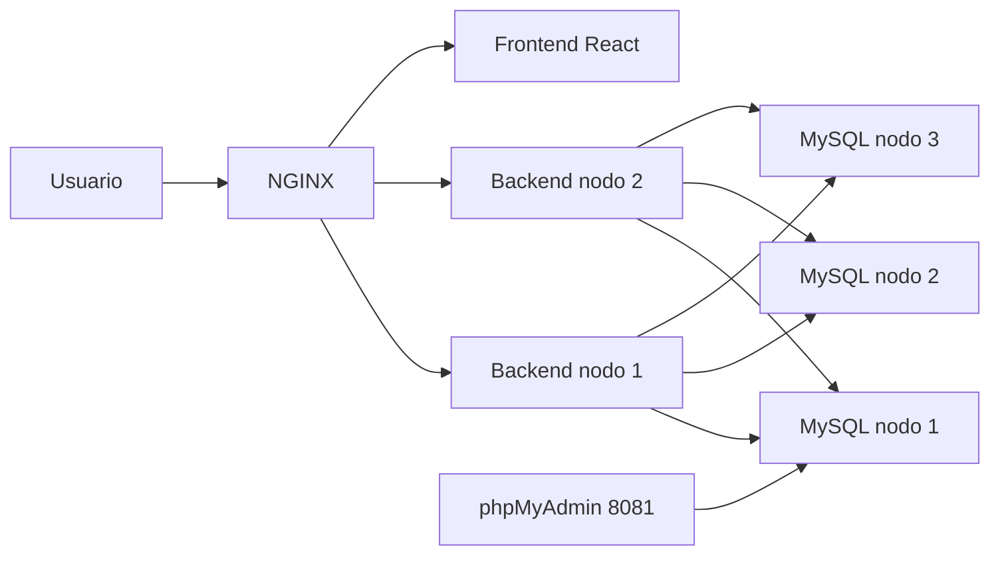

# Gestión de Pedidos

Plataforma web distribuida para gestionar pedidos con frontend React, backend FastAPI, balanceo NGINX, réplica de datos y herramientas de inspección como phpMyAdmin y Portainer.

## Cómo se usa

1. Levanta el stack:

```bash
docker-compose up --build -d
```

2. Abre la interfaz principal en:

```text
http://localhost
```

3. Entra con el usuario precargado de administración:

```text
Correo: admin@gestion-pedidos.local
Clave: Admin123!
Rol: admin
```

4. Si necesitas crear usuarios nuevos, usa el botón **Registrarte** en la pantalla de acceso o el endpoint:

```text
POST /api/autenticacion/registro
```

5. Para administrar pedidos entra a:

```text
http://localhost/pedidos
```

6. Para ver el panel operativo del sistema entra a:

```text
http://localhost/dashboard
```

## Puntos de acceso

| Recurso | URL |
| --- | --- |
| Aplicación React | `http://localhost` |
| API REST | `http://localhost/api` |
| Documentación Swagger | `http://localhost/docs` |
| phpMyAdmin | `http://localhost:8081` |
| Portainer | el puerto que ya tengas configurado en tu host |

## Qué hay dentro

- **Frontend:** React + Vite + CSS puro.
- **Backend:** FastAPI con auth, pedidos, salud y monitoreo.
- **Balanceo:** NGINX como entrada única pública.
- **Datos:** tres nodos MariaDB/MySQL para persistencia distribuida.
- **Herramientas de inspección:** phpMyAdmin en puerto dedicado y Portainer si ya lo tienes instalado en el host.

## Flujo de uso diario

1. El usuario entra a la página principal.
2. Se autentica con el admin precargado o se registra un usuario nuevo desde el login.
3. El rol `admin` accede al dashboard para ver incidentes, servicios caídos, recuperación y acciones de escritura.
4. El usuario normal solo puede consultar pedidos, buscar por ID y listar registros.
5. En el dashboard se puede simular una falla por servicio y luego recuperarlo.
6. phpMyAdmin permite revisar tablas, datos y relaciones sin tocar el backend.

## Arquitectura resumida


## Arquitectura Distribuida

El sistema implementa una arquitectura distribuida basada en:

- Balanceador NGINX
- Dos nodos FastAPI
- Clúster MariaDB Galera
- Frontend React
- Monitoreo centralizado

Flujo:

Usuario → NGINX → Backend → Base de Datos
```

## Diseño operativo

### Frontend

La SPA vive en `frontend/` y se construye con Vite. NGINX copia el build final al contenedor web y sirve la aplicación como una SPA estándar.

### Backend

FastAPI corre en dos nodos. Ambos leen la misma configuración, exponen las mismas rutas REST y usan el mismo modelo de autenticación. El sistema crea en el arranque un usuario `admin` precargado y deja abierta la ruta de registro para nuevos usuarios.

### Datos

El stack usa tres nodos MariaDB/MySQL y el backend intenta conectarse a cualquiera de ellos mediante `DATABASE_URLS`. Las tablas principales son `usuarios`, `pedidos` y `detalles_pedido`.

### Monitoreo

El dashboard consulta:

- `GET /api/salud`
- `GET /api/salud/detalle`
- `GET /api/monitoreo/estado`

Además permite:

- `POST /api/monitoreo/falla`
- `POST /api/monitoreo/recuperar`

La vista administrativa muestra:

- servicios supervisados
- resumen de operativos y caídos
- incidente activo
- última incidencia resuelta
- recomendaciones de operación

## phpMyAdmin y Portainer

### phpMyAdmin

El servicio queda en `http://localhost:8081` por defecto y apunta al nodo `mysql-nodo-1`. Sirve para inspeccionar tablas, relaciones y datos sin entrar al contenedor de base de datos. El puerto se puede cambiar con `PMA_PORT`.

### Portainer

Si ya lo usas en tu máquina, conéctalo al mismo Docker host para visualizar contenedores, redes y volúmenes. Este proyecto no lo reemplaza; solo deja el stack listo para que puedas seguir administrándolo desde Portainer.

## Variables de entorno

```env
MYSQL_DATABASE=pedidos
MYSQL_USER=pedidos_usuario
MYSQL_PASSWORD=pedidos_clave
MYSQL_ROOT_PASSWORD=root_clave
JWT_SECRETO=cambia-esta-llave
JWT_ALGORITMO=HS256
JWT_EXPIRACION_MINUTOS=480
ADMIN_NOMBRE=Administrador
ADMIN_CORREO=admin@gestion-pedidos.local
ADMIN_CLAVE=Admin123!
PMA_PORT=8081
```
## Seguridad

El sistema implementa:

- JWT para autenticación
- Validación de usuarios
- Variables de entorno
- Protección de rutas administrativas
- Manejo de roles
```

## Endpoints principales

- `POST /api/autenticacion/registro`
- `POST /api/autenticacion/login`
- `GET /api/autenticacion/me`
- `GET /api/pedidos`
- `GET /api/pedidos/{id}`
- `POST /api/pedidos`
- `PUT /api/pedidos/{id}`
- `DELETE /api/pedidos/{id}`
- `PATCH /api/pedidos/{id}/estado`
- `GET /api/salud`
- `GET /api/salud/detalle`
- `GET /api/monitoreo/estado`
- `POST /api/monitoreo/falla`
- `POST /api/monitoreo/recuperar`

## Notas de operación

- El frontend se compila dentro de la imagen de NGINX.
- El dashboard se refresca periódicamente para mostrar el estado de servicios y fallos.
- Si un servicio cae, el panel lo marca con detalle y muestra el diagnóstico completo.
- El nodo `mysql-nodo-1` usa un arranque guiado para recuperar el estado Galera cuando el volumen quedó marcado como no seguro para bootstrap.
- phpMyAdmin se expone en un puerto dedicado para no mezclarlo con la SPA.
- El puerto de phpMyAdmin se puede cambiar con `PMA_PORT`.
